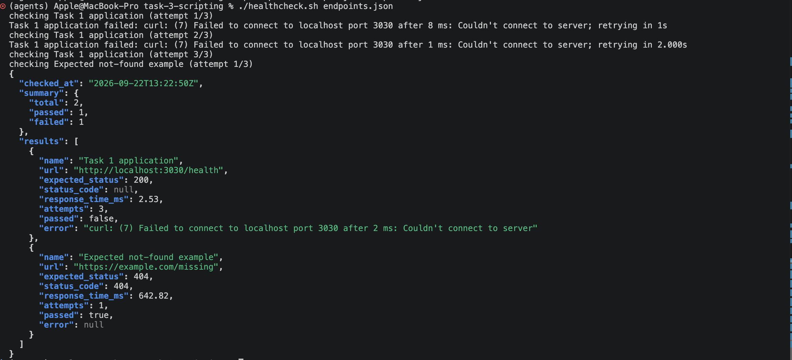

# Task 3: Bash HTTP Health Checker

## Overview

`healthcheck.sh` checks HTTP endpoints, reports status code and response time, retries failures with exponential backoff, outputs JSON, and exits non-zero if any endpoint remains unhealthy. Bash was chosen for portability in CI, cron, and operational environments.

## Setup and Run

Prerequisites: Bash 3.2+, `curl`, `jq`, and `awk`.

```bash
cd task-3-scripting
chmod +x healthcheck.sh
./healthcheck.sh endpoints.json
```

Configuration can also come from the environment:

```bash
export HEALTHCHECK_ENDPOINTS_JSON='{
  "endpoints": [
    {"name":"API","url":"https://api.example.com/health","expected_status":200}
  ]
}'
export HEALTHCHECK_MAX_ATTEMPTS=3
export HEALTHCHECK_BACKOFF_SECONDS=1
export HEALTHCHECK_TIMEOUT_SECONDS=10
./healthcheck.sh
```

Endpoint values `max_attempts`, `backoff_seconds`, and `timeout_seconds` override the global defaults. Retry logs go to stderr; JSON goes to stdout.

Exit codes:

- `0`: all endpoints passed.
- `1`: one or more endpoints failed after retries.
- `2`: invalid configuration or missing dependency.


## Design Decisions and Trade-offs

- **JSON config and output:** Easy for pipelines to generate and parse; requires `jq`.
- **Exponential backoff:** Handles transient failures but increases total runtime.
- **Sequential checks:** Simple and deterministic; slow for many endpoints.
- **Separate stdout/stderr:** Keeps JSON safe for pipeline artifacts while retaining retry logs.
- **Deterministic curl test double:** Tests retries and failures without relying on public services.

## Production Extension and Limitations

For production, use multi-region probes with Prometheus Blackbox Exporter, CloudWatch Synthetics, or Datadog Synthetics. Store historical latency and availability metrics, define SLOs, and alert through Alertmanager or PagerDuty only after sustained or multi-region failures. Manage checks and alerts through Terraform and inject authenticated-check credentials from a secret manager.

The script has no history, distributed probing, TLS-expiry checks, response-body validation, alert deduplication, or concurrency. It is appropriate as a pipeline gate or lightweight cron check, not a complete monitoring platform.

## Assumptions

- Endpoints are reachable from the machine running the script.
- HTTP status is sufficient for this assessment's health decision.
- Authentication headers are not required.

## Cleanup

Task 3 creates no cloud resources. Remove local output/config files if created:

```bash
rm -f endpoints.json health-results.json
```

## Results



